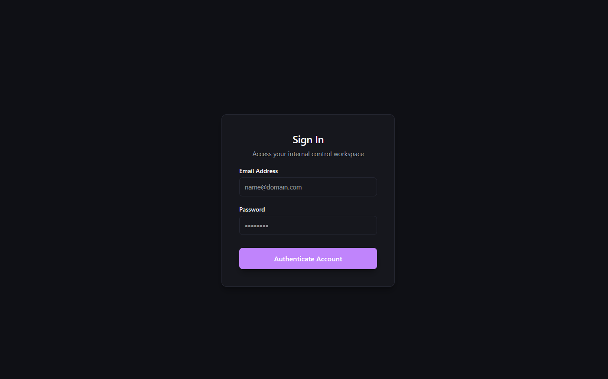
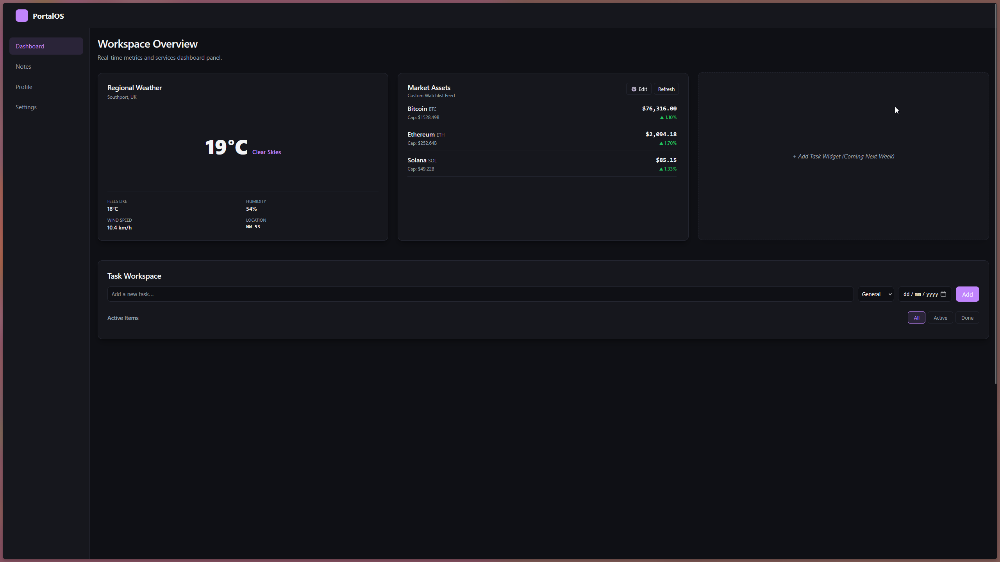
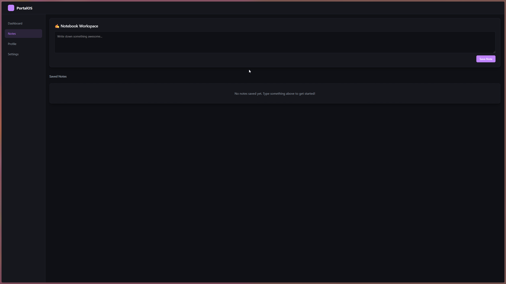
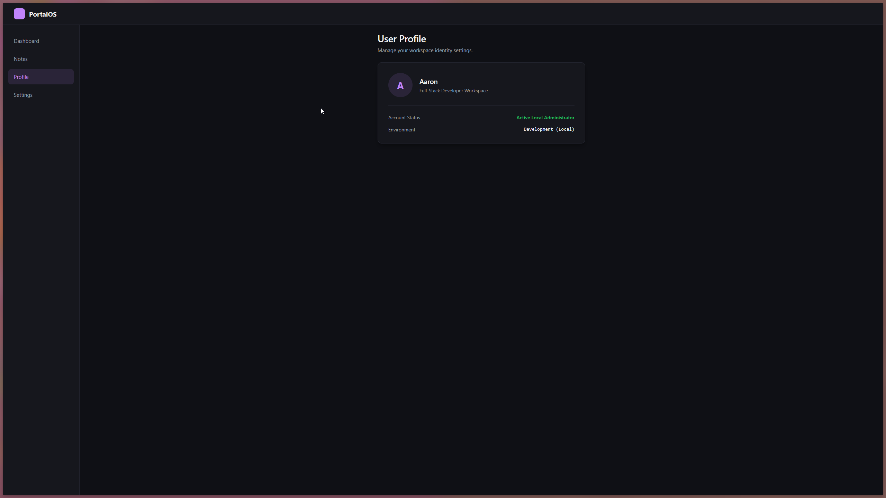
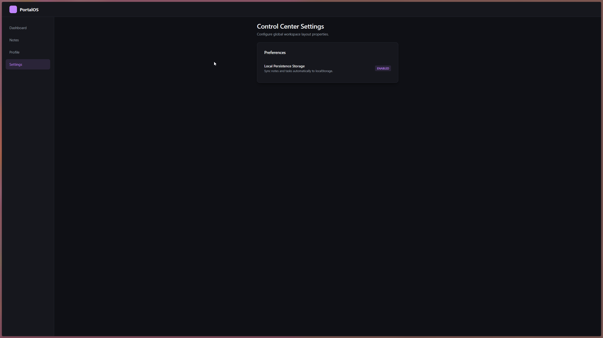

# Personal Dashboard (v2)

A modern, responsive, and secure single-page workspace portal built using React. This dashboard features dynamic third-party API integration, robust protected routing and a robust persistent local storage modules.

## 🚀 Key Features

* **🔒 Gatekeeper Authentication Guard**: Implements a strict frontend security shell using `react-router-dom`. Anonymous traffic is automatically intercepted and redirected to a validated login workspace.
* **📋 Controlled Sign-In Form**: Built completely with controlled inputs featuring live regex verification patterns and inline error message state clearings.

* **🌦️ Real-Time Regional Weather Widget**: Queries the Open-Meteo API to parse telemetry for Southport, UK. Converts raw WMO data codes into user-friendly status readouts, displaying wind speed, ambient humidity, and "feels-like" metrics.
* **🪙 Custom Watchlist Crypto Ticker**: Integrates with the CoinGecko API. Features an interactive toggle configuration panel allowing users to choose exactly which tokens to monitor, complete with live 24h market cap shift calculations and color-coded gain/loss metrics.
* **🛠️ Task Management Terminal**: A robust task-handling grid featuring categories, due dates, editing overrides, status filtering, and layout matching.

* **✍️ Persistent Notebook Workspace**: A full CRUD notes page automatically stored with `localStorage`.

* **👤 User Profile**: A comprehensive user profile page with detailed information about the logged-in user, including their name, email, and a brief bio.

* **⚙️ System Settings**: A comprehensive system settings page with customizable options.



---

## 🛠️ Architecture & Tech Stack

* **Frontend Library**: React (Hooks: `useState`, `useEffect`, `useCallback`, `useMemo`)
* **Routing Engine**: React Router v6 (`BrowserRouter`, `Routes`, `Route`, `Maps`, `useNavigate`)
* **Data Layer**: Custom Abstracted Asynchronous Fetching Hook (`useFetch.js`)
* **Styling**: Pure CSS Custom Properties (Variables) styled fluidly via inline layout matrices and custom flex-grid wrappers (`dashboard-grid`).

---

## 💻 Getting Started Locally

Follow these steps to spin up the dashboard in your local development environment:

### 1. Clone the Repository
```bash
git clone [https://github.com/YOUR_USERNAME/YOUR_REPO_NAME.git](https://github.com/YOUR_USERNAME/YOUR_REPO_NAME.git)
cd YOUR_REPO_NAME
```

### 2. Install Project Dependencies

This will download the required library modules (like React Router) without cluttering up version control tracks:
```bash
npm install
```

#### 3. Start Development Server
To run the development server, execute the following command:

```bash
npm run dev
```


## 📁 Core Directory Structure

```
└── 📁src
    └── 📁components
        └── 📁layout
            ├── Navbar.jsx
            ├── Sidebar.jsx
        └── 📁notes
            ├── Notes.jsx
        └── 📁todo
            ├── Todo.jsx
            ├── TodoForm.jsx
            ├── TodoItem.jsx
            ├── TodoList.jsx
        └── 📁widgets
            ├── CryptoWidget.jsx
            ├── Loader.jsx
            ├── WeatherWidget.jsx
    └── 📁context
        ├── ThemeContext.jsx
    └── 📁hooks
        ├── useFetch.js
    └── 📁pages
        ├── Dashboard.jsx
        ├── Home.jsx
        ├── Notes.jsx
        ├── Profile.jsx
        ├── Settings.jsx
    └── 📁services
        ├── api.js
    └── 📁utils
        ├── formatDate.js
    ├── App.css
    ├── App.jsx
    ├── index.css
    └── main.jsx
```

